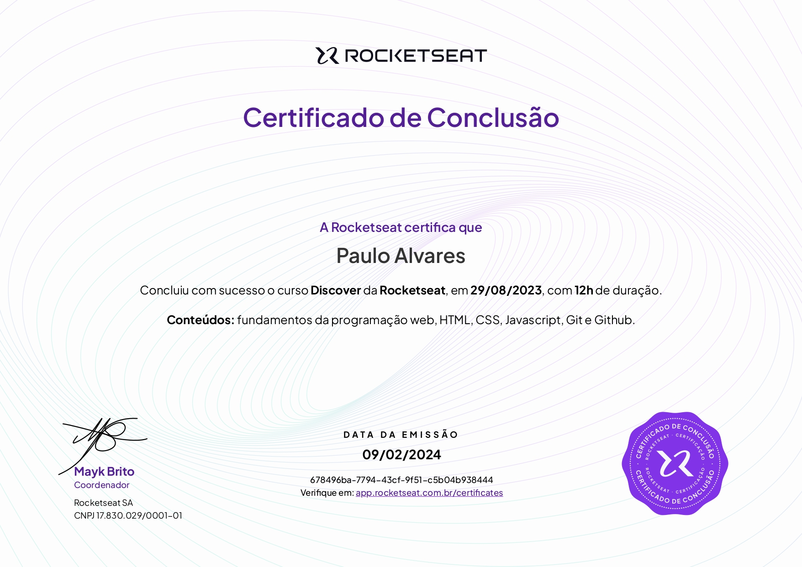

  
  <h3 align="center">Discover - Rocketseat</h3>

# 🔍Visão Geral
  Esta formação oferece 1 trilha voltada para desenvolvimento web, cobrindo desde os fundamentos iniciais de HTML, CSS e JavaScript até tecnologias mais avançadas, como Git, GitHub e Node.js. O projeto desenvolvido ajuda a formar uma base sólida e eficiente em projetos web, criando aplicações modernas, escaláveis e com boas práticas de desenvolvimento, tanto no front-end quanto no back-end.

# 📚Conteúdo Abordado
  * **Introdução**
    * **Primeiros Passos**
    * **Aprendendo a Aprender**
  * **Começado o Projeto**
    * **Iniciando o HTML e CSS**
    * **Avançando o HTML e CSS**
  * **Finalizando o Projeto**
    * **JavaScript**
    * **Git e GitHub**
  * **Projeto Final**
  * **Seu Próximo Passo na Programação**

  <h3>💻Tecnologias Aprendidas</h3>
  

# 🏅Certificados

# 🔗Recursos Adicionais
### 🔧Ferramentas
  - <a href="https://code.visualstudio.com/download">Visual Studio Code</a>

### 📦Linguagens e Pacotes
  - <a href="https://nodejs.org/en/download/package-manager">Node.Js</a>
  - <a href="https://git-scm.com/downloads">Git</a>

### 📖Guias de Referência
  - <a href="https://developer.mozilla.org/en-US/docs/Web/HTML">HTML</a>
  - <a href="https://developer.mozilla.org/en-US/docs/Web/CSS">CSS</a>
  - <a href="https://developer.mozilla.org/en-US/docs/Web/JavaScript">JavaScript</a>
  - <a href="https://nodejs.org/docs/latest/api/">Node.Js</a>
  - <a href="https://git-scm.com/doc">Git</a>
  - <a href="https://docs.github.com">GitHub</a>

### 📎Curso
  - <a href="https://app.rocketseat.com.br/journey/discover/contents">Discover</a>

# 📬Contato

 
  
  
   
  
  
  

